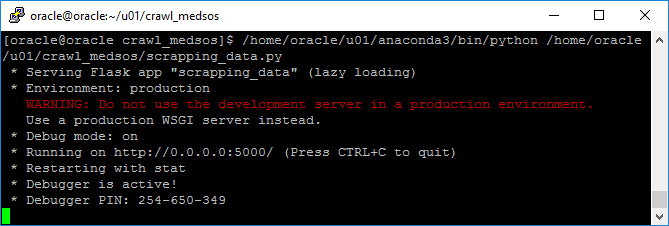
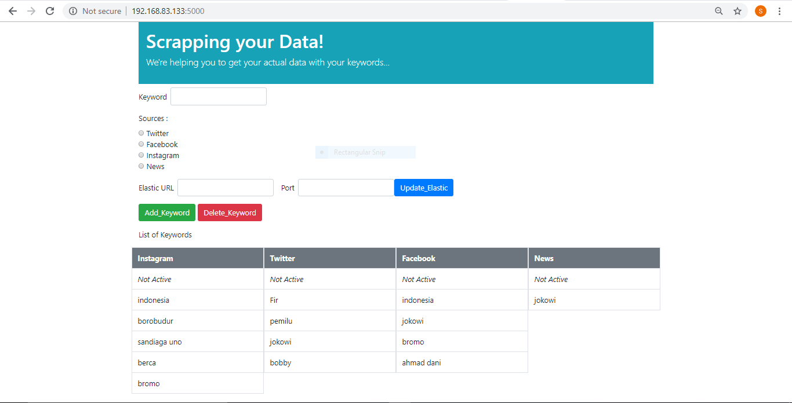
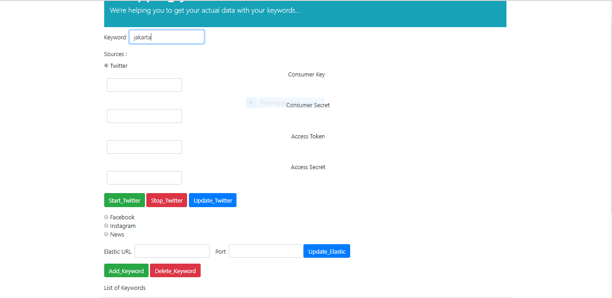
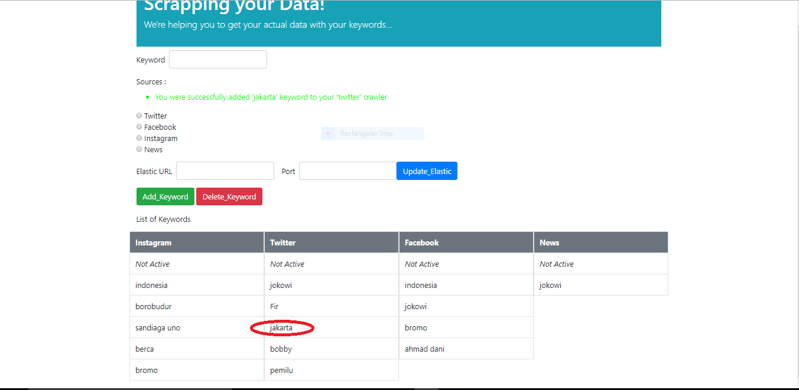

# Media Social Crawler

This program is created to crawling data from social media sources, likes Twitter, Instagram, Facebook, and News.
The crawler that available nows is for Twitter and News. This program is running on CENTOS environment. 
And make sure you have elasticsearch and kibana installed on your system because the data that has been crawled will be stored in elasticsearch.

And now, for running the program, using this command :

`python scrapping_data.py`

Now, open your IP address which your program is located :

Now, for adding keyword for crawling :
1. Fill form with the keyword that you want added 
2. Next, choose one for available source

3. After that, click "Add_Keyword"
4. And the keyword is successfully adding to your crawler

Now, to start crawling program :
1. Choose one for available source (example : Twitter)
2. Click "Start_Twitter"

3. After that, you can check in the console that crawler program is running

4. You can check too on your kibana data that has entered
